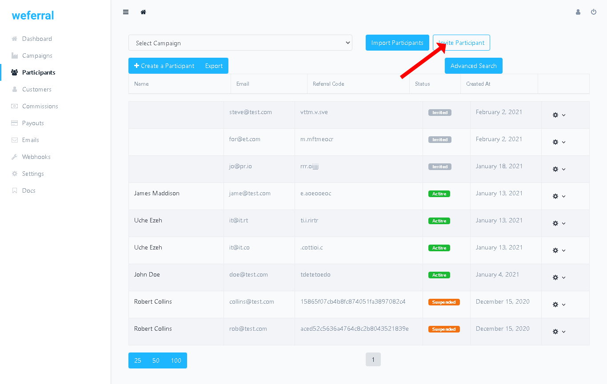
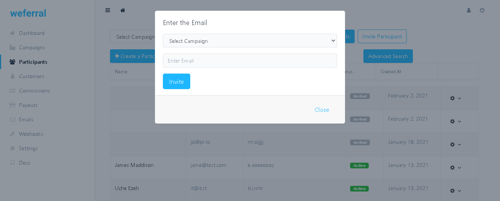
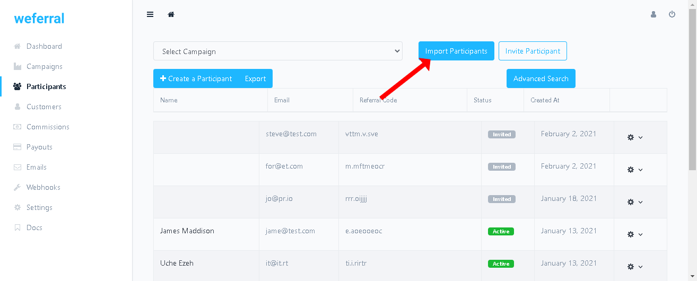
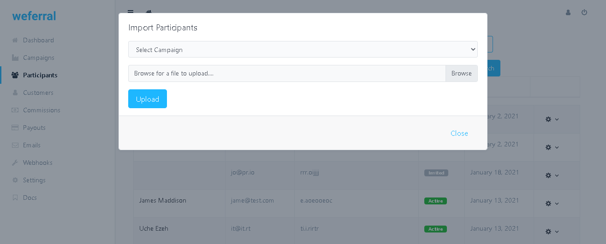

# What are Campaigns?

Campaigns allow you to set different rewards with different messaging for your affiliates, influencers and ambassadors. For ex, your basic affiliates may have their own campaign with a specific reward(like $50 reward per sale) and your influencers(persons of high authority in their fields) may have 25% recurring commission.

Each campaign has its own set of emails, its own participant signup page and participant(affiliate) dashboard.

## When should I create multiple campaigns?

You can set up multiple campaigns when you need to give different rewards to a different group of participants like in the example above.

## Inviting participant to join a campaign

You can invite participants by going to Participants > click "Invite Participant" button > from the popup select the campaign where you want to invite the participant to and then enter their email > Invite participants.

## Import participants to join a campaign

You can import participants by going to Participants > click "Import Participants" button > from the popup select the campaign where you want to invite the participant to, select csv file with list of participant you wish to invite to the campaign then upload.

