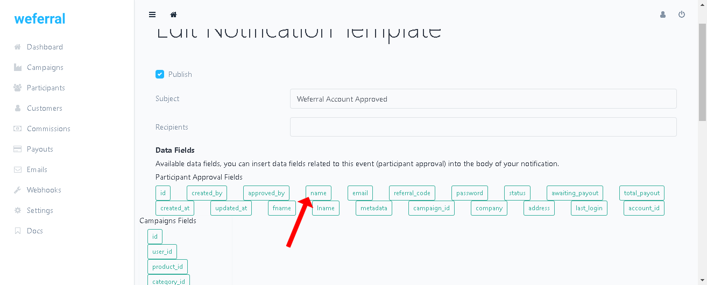
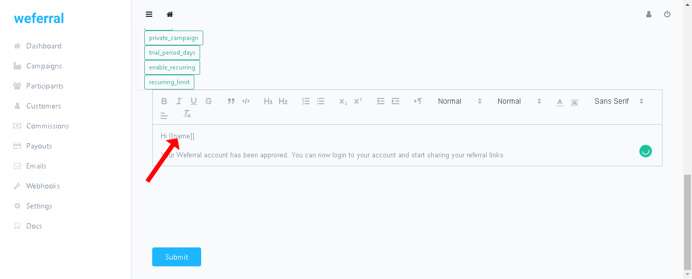

# How to setup email notifications.
You can setup customized email notifications. You can automate several types of notifications, like notifying yourself when a participant signed up for a program or letting participants know when a commission is generated.

# Customizing email notifications
You can always customize default email notifications for each campaign

* Click on "Emails" on the sidebar, on the email notifications page, select the campaign you wish to work on, then click on the email notification you want to customize

* Edit the subject line, you can add recipients you want to also receive the email notification

* To edit the email message, you can highlight to select it, then use the edit options to customize the text.

* On the email notification page you can find "Data fields" you can use to personalize the message (add the participant's name), place your cursor on section of email text you want to add a "Data field" then click on any "Data field" to add it to the email message.

1. Select "Data field"

2. Add it to your email message

